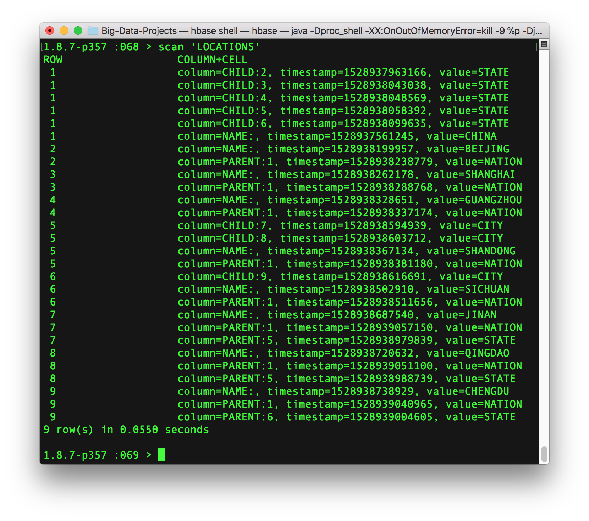
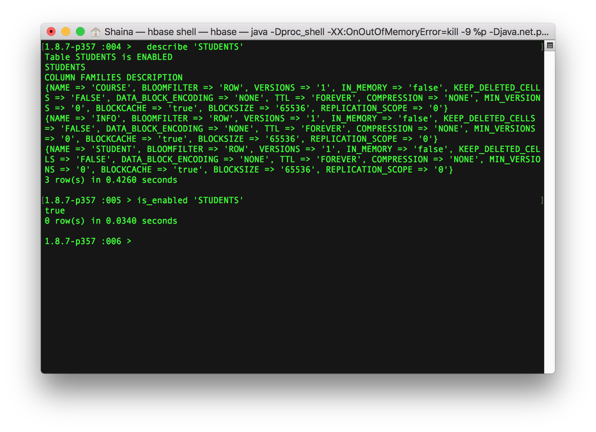

Terminal Commands  
-

Install HBase (Mac):

```ruby
brew install hbase
```

Start HBase:

```ruby
start-hbase.sh
```

Go into shell:

```ruby
hbase shell
```

>
Use Case 1: Locations
<ol>
<li>China</li>
<li>Beijing</li>
<li>Shanghai</li>
<li>Guangzhou</li>
<li>Shandong <ol start="7" style="margin-bottom:0">
		<li>Jinan</li>
		<li>Qingdao</li>
	</ol></li>
<li>Sichuan <ol start="9">
		<li>Chengdu</li>
	</ol></li>
</ol>

Create table:

```ruby
create 'LOCATIONS', 'NAME', 'PARENT', 'CHILD'
```

Populate table:

```ruby
put 'LOCATIONS', '1', 'NAME', 'CHINA'
put 'LOCATIONS', '1', 'CHILD:2', 'CITY'
put 'LOCATIONS', '1', 'CHILD:3', 'CITY'
put 'LOCATIONS', '1', 'CHILD:4', 'CITY'
put 'LOCATIONS', '1', 'CHILD:5', 'CITY'
put 'LOCATIONS', '1', 'CHILD:2', 'STATE'
put 'LOCATIONS', '1', 'CHILD:3', 'STATE'
put 'LOCATIONS', '1', 'CHILD:4', 'STATE'
put 'LOCATIONS', '1', 'CHILD:5', 'STATE'
put 'LOCATIONS', '1', 'CHILD:6', 'STATE'

put 'LOCATIONS', '2', 'NAME', 'BEIJING'
put 'LOCATIONS', '2', 'PARENT:1', 'NATION'

put 'LOCATIONS', '3', 'NAME', 'SHANGHAI'
put 'LOCATIONS', '3', 'PARENT:1', 'NATION'

put 'LOCATIONS', '4', 'NAME', 'GUANGZHOU'
put 'LOCATIONS', '4', 'PARENT:1', 'NATION'

put 'LOCATIONS', '5', 'NAME', 'SHANDONG'
put 'LOCATIONS', '5', 'PARENT:1', 'NATION'

put 'LOCATIONS', '6', 'NAME', 'SICHUAN'
put 'LOCATIONS', '6', 'PARENT:1', 'NATION'

put 'LOCATIONS', '5', 'CHILD:7', 'CITY'
put 'LOCATIONS', '5', 'CHILD:8', 'CITY'

put 'LOCATIONS', '6', 'CHILD:9', 'CITY'

put 'LOCATIONS', '7', 'NAME', 'JINAN'

put 'LOCATIONS', '8', 'NAME', 'QINGDAO'
put 'LOCATIONS', '9', 'NAME', 'CHENGDU'

put 'LOCATIONS', '7', 'PARENT:5', 'STATE'
put 'LOCATIONS', '8', 'PARENT:5', 'STATE'
put 'LOCATIONS', '9', 'PARENT:6', 'STATE'

put 'LOCATIONS', '7', 'PARENT:1', 'NATION'
put 'LOCATIONS', '8', 'PARENT:1', 'NATION'
put 'LOCATIONS', '9', 'PARENT:1', 'NATION'
```


List row contents:

```ruby
get 'LOCATIONS', '1'
```


List table contents:

```ruby
scan 'LOCATIONS'
```

Table contents:  


>
> Use Case 2: Student-Course  

> - Student  
> 	- 1 S ~ manyC 
> - Course
> 	- 1 C ~ manyS

Create tables:

```ruby
create 'STUDENTS', 'INFO', 'COURSE'
create 'COURSES', 'INFO', 'STUDENT'
```

Populate tables:

```ruby
put 'STUDENTS', '1900', 'INFO:NAME', 'SAM'
put 'STUDENTS', '1900', 'INFO:SEX', 'F'
put 'STUDENTS', '1900', 'INFO:AGE', '20'
put 'STUDENTS', '1900', 'COURSE:HIST560', 'UNDERGRAD'
put 'STUDENTS', '1900', 'COURSE:PSYC645', 'UNDERGRAD'

put 'STUDENTS', '1700', 'INFO:NAME', 'BLAKE'
put 'STUDENTS', '1700', 'INFO:SEX', 'M'
put 'STUDENTS', '1700', 'INFO:AGE', '18'
put 'STUDENTS', '1700', 'COURSE:PSYC645', 'UNDERGRAD'
put 'STUDENTS', '1700', 'COURSE:PSYC690', 'UNDERGRAD'

put 'COURSES', 'PSYC645', 'INFO:TITLE', 'ABNORMAL_HUMAN_BEHAVIOR'
put 'COURSES', 'PSYC645', 'INFO:INTRODUCTION', 'DEGREE_REQUIREMENT'
put 'COURSES', 'PSYC645', 'INFO:TEACHER_ID', '1000000'
put 'COURSES', 'PSYC645', 'STUDENT:1900', 'UNDERGRAD'
put 'COURSES', 'PSYC645', 'STUDENT:1700', 'UNDERGRAD'
```

List row contents:

```ruby
get 'STUDENTS', '1900'
get 'STUDENTS', '1700'
get 'COURSES', 'PSYC645'
```

List table contents:

```ruby
scan 'STUDENTS'
scan 'COURSES'
```

Table contents:  


>
> Use Case 3: User-Action  

> - Users perform actions now and then
> 	- store every event
> 	- query recent events of a user

Create table:

```ruby
create 'USER-ACTION', 'NAME'
```

Populate table:

```ruby
put 'USER-ACTION', "0000000-"+(JavaLang::Long::MAX_VALUE - JavaLang::System.currentTimeMillis()).to_s+"-123", 'NAME', '123'
```

List table contents:

```ruby
scan 'USER-ACTION'
```

List row contents:

```ruby
get 'USER-ACTION', '(see below)'
```  

*Copy and paste the row key from the scan 'USER-ACTION command, and paste it in single quotes above. In this example, the row key at the time of writing was 0000000-9223370507562268313-123.*

Table contents:  


> Query Command Examples:
<ol type="a">
<li>General HBase shell commands</li>
<li>Tables management commands</li>
<li>Data manipulation commands</li>
<li>HBase surgery tools</li>
</ol>

General HBase shell commands:

```ruby
status
version
```


Table management commands:

```ruby
describe 'STUDENTS'
is_enabled 'STUDENTS'
```


Data manipulation commands:

```ruby
count 'STUDENTS'
scan 'STUDENTS'
```


HBase surgery tools:

```ruby
balancer
balance_switch true
```


Stop HBase:

```ruby
stop-hbase.sh
```